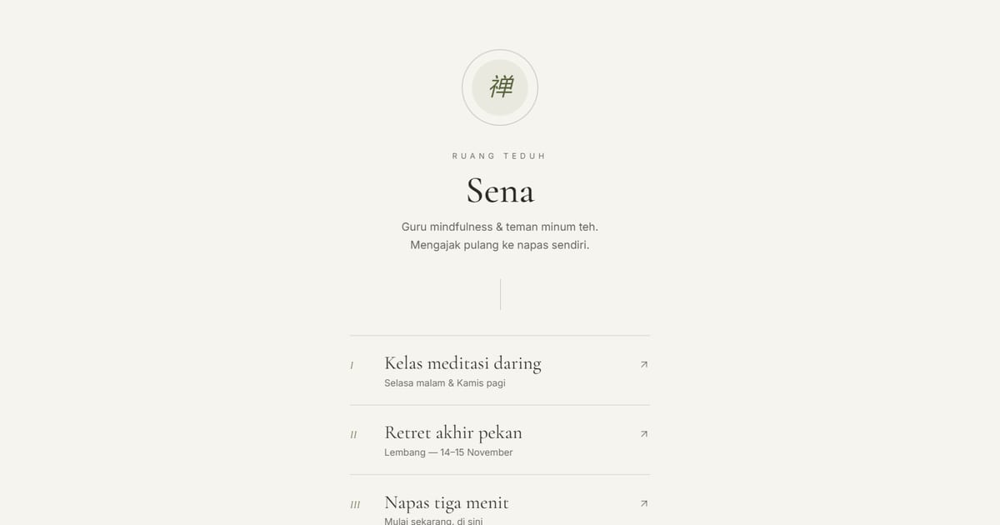

# Sena — Guru Mindfulness & Teman Minum Teh

Tautan Sena, guru mindfulness di Bandung: kelas meditasi daring Selasa dan Kamis, retret Lembang 14–15 November 2026, dan latihan napas terpandu tiga menit.

**Demo live:** https://linkinbio-zen.vercel.app



> Template link-in-bio dengan persona fiktif. Akun, klien, harga, dan jadwal hanya contoh; tautan utama menuju halaman dalam yang benar-benar ada, dan formulir tidak mengirim data.

## Konsep

Persona Sena, mindfulness dan teh. Minimal serif dengan lingkaran enso yang bernapas, daftar angka Romawi, dan benang vertikal.

## Halaman

- `/` — enso yang bernapas, daftar tautan berangka Romawi, garis benang vertikal, kutipan
- `/kelas` — jadwal kelas, paket, susunan acara retret, formulir daftar
- `/napas` — pemandu napas interaktif: tiga pola, durasi 1/3/5 menit, lingkaran mengembang-mengempis

## Teknologi

- Next.js 15.5 (App Router) dan React 19
- Tailwind CSS v4
- JavaScript
- Lucide (ikon)
- Font: Cormorant Garamond, Inter (next/font)
- SEO: metadata per halaman, Open Graph, JSON-LD, sitemap.xml, dan robots.txt

## Menjalankan secara lokal

```bash
npm install
npm run dev
```

Buka http://localhost:3000. Untuk build produksi: `npm run build` lalu `npm start`.

---

Bagian dari koleksi 12 template link-in-bio di [PortalBio](https://www.pintuweb.com/link-in-bio). Dibuat oleh [PintuWeb](https://www.pintuweb.com), jasa pembuatan website.
